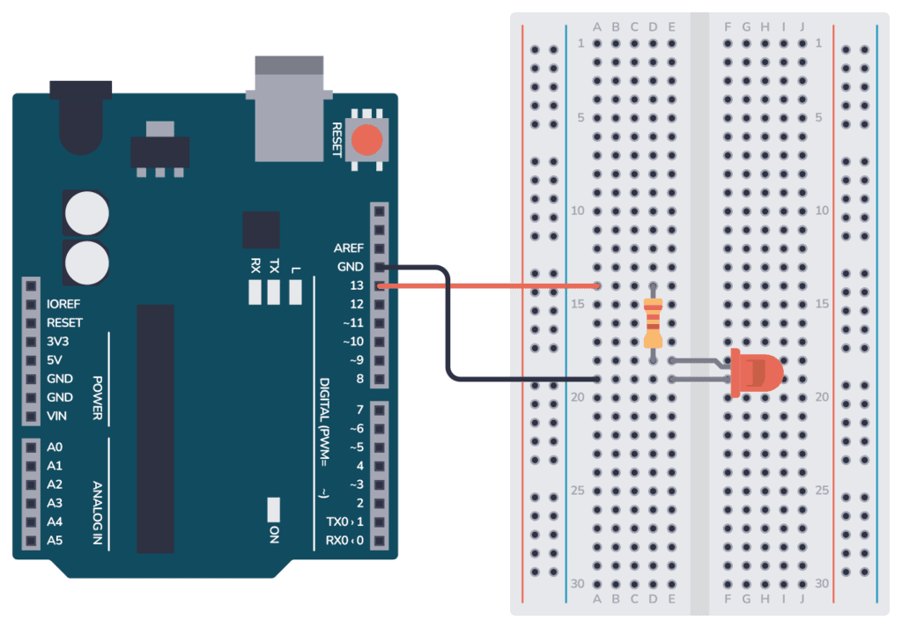

# Arduino LED Blink – Circuit and Code Example

The LED Blink circuit is the perfect starting point for learning Arduino.  
It’s simple, easy to set up, and introduces you to basic code and connections.

---

## Parts Needed
- Arduino Uno  
- Breadboard and jumper wires  
- LED  
- Resistor (220 Ω – 1 kΩ)  

---

## Circuit
The LED is connected in series with a resistor to limit current.  
Connect the resistor between **digital pin 13** and the LED anode (+), and connect the LED cathode (–) to **GND**.



---

## Code

```cpp
void setup() {  
  pinMode(13, OUTPUT);
}

void loop() {
  digitalWrite(13, HIGH);
  delay(1000);
  digitalWrite(13, LOW);
  delay(1000);
}
